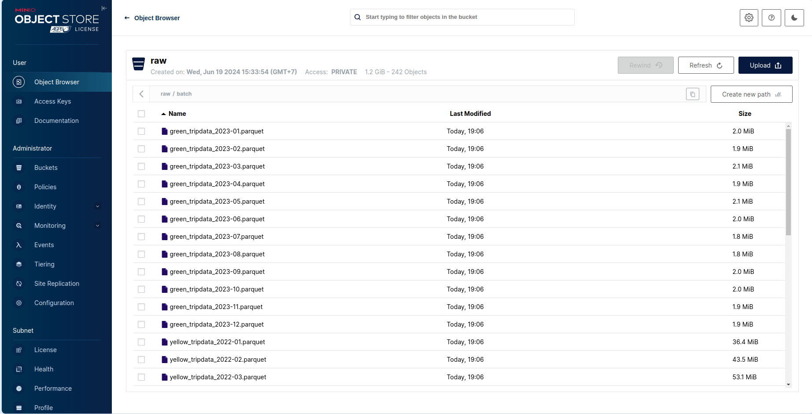
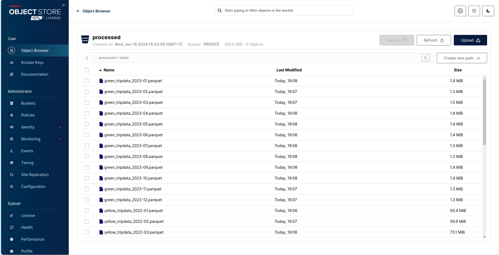
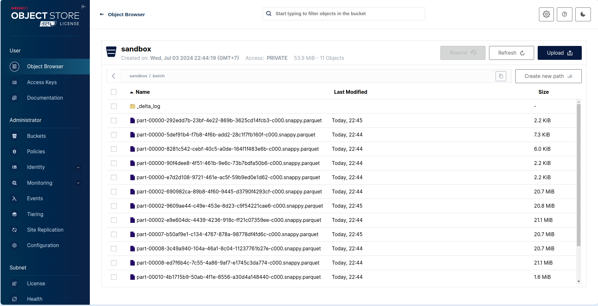
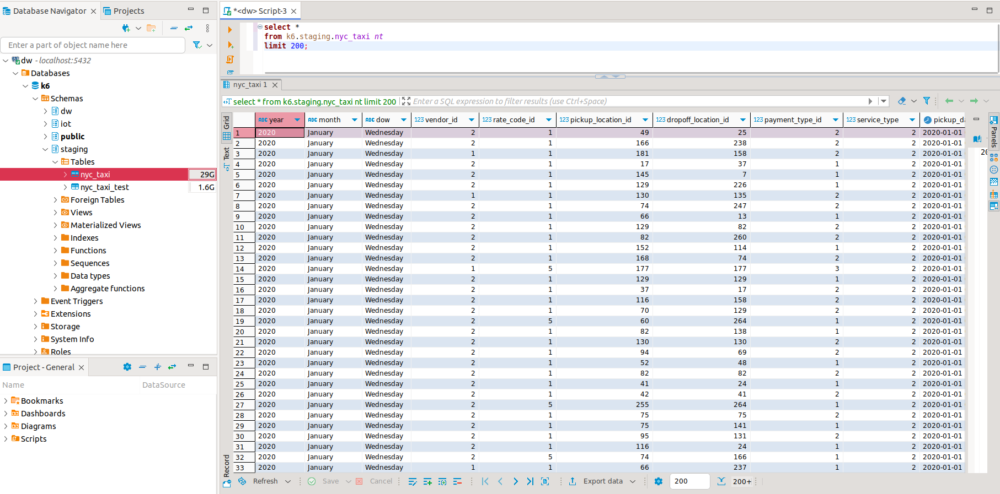
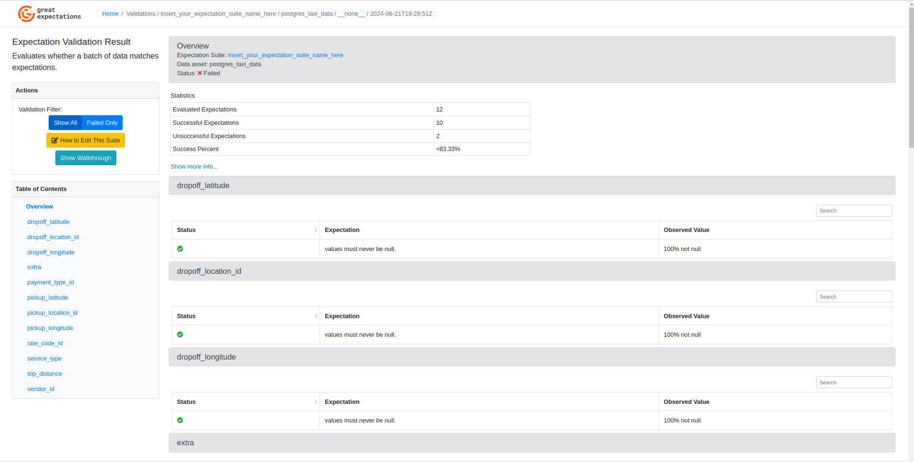
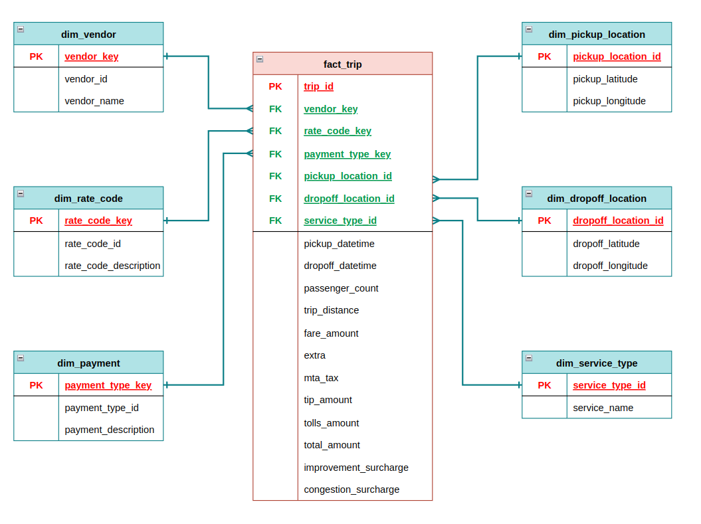
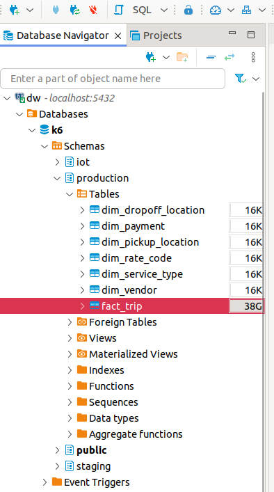
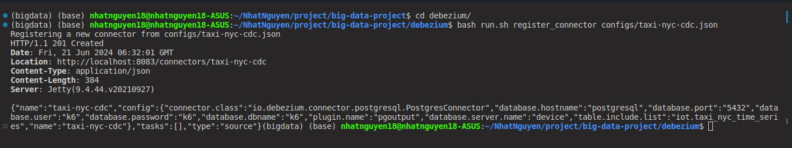
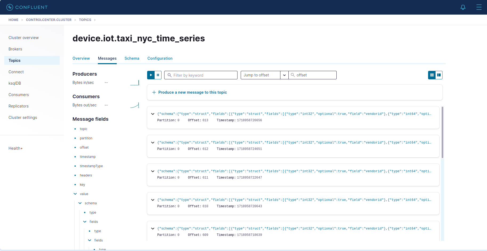
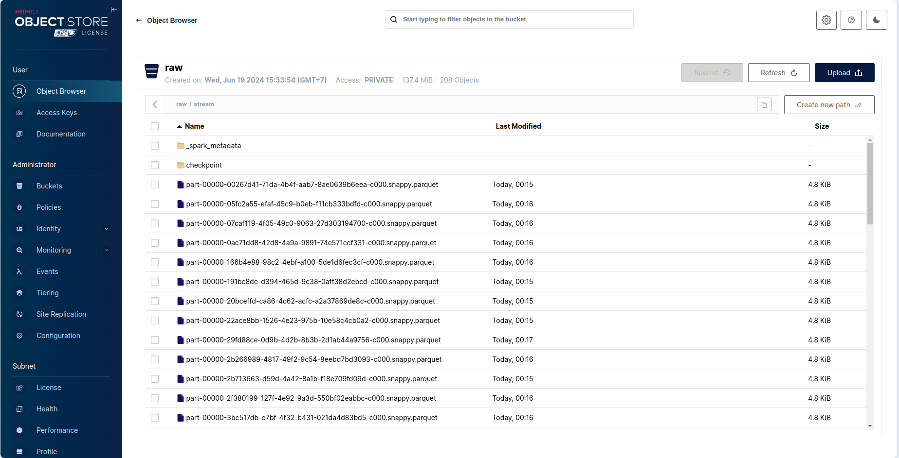

# 🚕 NYC TAXI DATA PIPELINE

**Hệ thống Batch & Streaming Data Pipeline xử lý dữ liệu taxi New York**

---

## 📋 Mô tả dự án

Dự án xây dựng một data pipeline hoàn chỉnh để thu thập, xử lý, lưu trữ và phân tích dữ liệu chuyến đi taxi NYC (Yellow, Green taxi). Hệ thống kết hợp xử lý batch và streaming theo kiến trúc Lakehouse, phục vụ phân tích chiến lược kinh doanh và dashboard trực quan.

# 🌟 System Architecture

<p align="center">


<p align="center">
    System Architecture
</p>

## ✨ Tính năng chính

- **Batch ETL Pipeline**: Quy trình Extract → Transform → Load hoàn chỉnh với PySpark & Pandas
- **3-Tier Data Lake**: Lưu trữ theo kiến trúc Raw → Processed → Sandbox trên MinIO (S3-compatible)
- **CDC Streaming**: Debezium captures real-time changes từ PostgreSQL
- **Data Warehouse**: PostgreSQL với kiến trúc Staging → Production
- **dbt Transformations**: Xây dựng data models và business logic trong DWH
- **Data Quality Checks**: Great Expectations validation cho dữ liệu đầu vào
- **Orchestration**: Apache Airflow quản lý và lập lịch các DAGs
- **Dashboard Trực quan**: Streamlit + Plotly hiển thị metrics, xu hướng, heatmaps

---

## 🛠️ Công nghệ sử dụng

| Danh mục           | Công nghệ                                       |
| ------------------ | ----------------------------------------------- |
| **Container**      | Docker Compose                                  |
| **Data Lake**      | MinIO (S3-compatible)                           |
| **Data Warehouse** | PostgreSQL 14                                   |
| **Processing**     | PySpark 3.5.1, Pandas 2.2.2                     |
| **Streaming**      | Apache Kafka 7.5.0, Debezium 1.9                |
| **Orchestration**  | Apache Airflow 2.7.1                            |
| **Transformation** | dbt-core 1.6.5                                  |
| **Data Quality**   | Great Expectations 0.17.21                      |
| **Dashboard**      | Streamlit, Plotly, PyDeck                       |
| **Python Libs**    | kafka-python, delta-spark, sqlalchemy, psycopg2 |

---

## 📁 Cấu trúc thư mục

NYC_taxi/
├── airflow/ # Airflow DAGs folder
│ ├── dags # contain etl_pipeline_dag.py
├── config/ # Configuration files
│ ├── datalake.yaml
│ └── spark.yaml
├── data/ # Raw data (Parquet files 2025, 2026)
│ ├── 2025
│ └── 2026
├── data_validation/ # Data Validate
│ ├── checkpoints
│ └── expectations
├── dbt_nyc/ # dbt project
│ ├── macros/
│ ├── models/
├── production # contains both dim_table và fact_table
│ └── staging # contains data source
│ ├── seed/
│ ├── snapshots/
│ └── file.yml
├── debezium/ # Debezium CDC configs
├── scripts_pipeline/ # ETL scripts
│ ├── extract.py # Upload to MinIO
│ ├── transform_data.py # Clean & merge taxi zones
│ ├── datalake_to_dwh.py # Spark → PostgreSQL
│ └── load_delta.py # load data to delta lake
├── streaming_processing/ # Kafka streaming scripts
│ ├── read_parquet_streaming.py
│ ├── schema_config.json
│ ├── streaming_to_datalake # load data from kafka to data lake
├── utils/ # Shared utilities
│ ├── create_schema.py
│ ├── create_table.py
│ ├── minio_utils.py
│ ├── postgresql_client.py
│ └── streaming_data_db.py # insert data to kafka
├── streamlit/ # Dashboard app
│ └── app.py
├── docker-compose.yaml # Full stack deployment
├── requirements_data.txt # Python dependencies
├── requirements_airflow.txt
└── .env # Environment variables

---

## 📊 Data Flow

┌─────────────┐ ┌─────────────┐ ┌─────────────┐
│ Raw Data │────▶│ MinIO │────▶│ Processed │
│ (Parquet) │ │ (DataLake) │ │ (S3) │
└─────────────┘ └─────────────┘ └─────────────┘
│
▼
┌─────────────┐ ┌─────────────┐ ┌─────────────┐
│ Dashboard │◀────│ PostgreSQL │◀────│ Spark │
│ (Streamlit)│ │ (DWH) │ │ (Staging) │
└─────────────┘ └─────────────┘ └─────────────┘
▲
│
┌──────┴──────┐
│ Debezium │
│ (Streaming)│
└─────────────┘

---

## 🚀 Hướng dẫn cài đặt

### Yêu cầu hệ thống

- Docker & Docker Compose
- Python 3.9+

### Các bước cài đặt

1.  **Clone the repository**

    ```bash
    git clone <https://github.com/quangteohn23/NYC_taxi>
    cd NYC_taxi
    ```

2.  **Khởi động tất cả services**

    ```bash
    docker-compose up -d
    ```

3.  **Kiểm tra các services**
    - MinIO Console: http://localhost:9001
    - Credentials: minio_access_key / minio_secret_key
    - Airflow: http://localhost:8080
    - Credentials: airflow / airflow
    - PostgreSQL DWH: localhost:5432
    - Credentials: nyc_taxi / nyc_taxi
    - Kafka: localhost:9092
    - Debezium: http://localhost:8083
    - Debezium UI: http://localhost:8085
    - AKHQ (Kafka UI): http://localhost:8086

# Activate virtual environment

source venv_data/bin/activate

## I. Batch Processing

1.  **Push the data (parquet format) from local to `raw` bucket - Datalake (MinIO)**:

```bash
    python scripts_pipeline/extract.py
```

<p align="center">


<p align="center">
    Pushed the data to MinIO successfully
</p>

2. **Process the data from `raw` to `processed` bucket (MinIO)**:

```bash
    python scripts_pipeline/transform_data.py
```

<p align="center">


<p align="center">
    Processed the data successfully
</p>

3. **Convert the data into Delta Lake format**:

```bash
    python scripts_pipeline/load_delta.py
```

<p align="center">


<p align="center">
    Converted the data successfully
</p>

4. **Create schema `staging`, `production` and table `staging.nyc_taxi` in PostgreSQL**

```bash
   python utils/create_schema.py
   python utils/create_table.py
```

5. **Execute Spark to read, process the data from Datalake (MinIO) and write to Staging Area**

```bash
   python scripts_pipeline/datalake_to_dwh.py
```

This command may take a little time to process.

<p align="center">


<p align="center">
    Queried the data after executing Spark
</p>

6. **Validate data in Staging Area**

```bash
   cd data_validation
   great_expectations init
   Y
```

Then, run the file `full_flow.ipynb`

<p align="center">


<p align="center">
    Validated the data using Great Expectations
</p>

7. **Use DBT to transform the data and create a star schema in the data warehouse**

```bash
   cd dbt_nyc
   dbt test # check model
   dbt run # run model
```

<p align="center">


<p align="center">
    Data Warehouse - Star Schema
</p>

8. **(Optional) Check the data in the Data Warehouse**

<p align="center">


## II. Stream Processing

1. **Create Connector Postgres to Debezium**:

```bash
   cd debezium/
   bash run.sh register_connector configs/taxi-nyc-cdc.json
```

<p align="center">


<p align="center">
    Created Debezium Connector successfully
</p>

2. **Create an empty table in PostgreSQL and insert new record to the table**:

```bash
   cd ..
   python utils/create_schema.py
   python utils/create_table.py
   python utils/streaming_data_db.py
```

Access `localhost:9021` to check the data stream in the `device.iot.taxi_nyc_time_series` Topic.

<p align="center">


<p align="center">
    Data stream in `device.iot.taxi_nyc_time_series` Kafka Topic
</p>

3. **Read and write data stream to 'raw' bucket in MinIO**

```bash
   python stream_processing/streaming_to_datalake.py
```

<p align="center">


<p align="center">
    Data Stream stored into 'raw' bucket in MinIO
</p>
